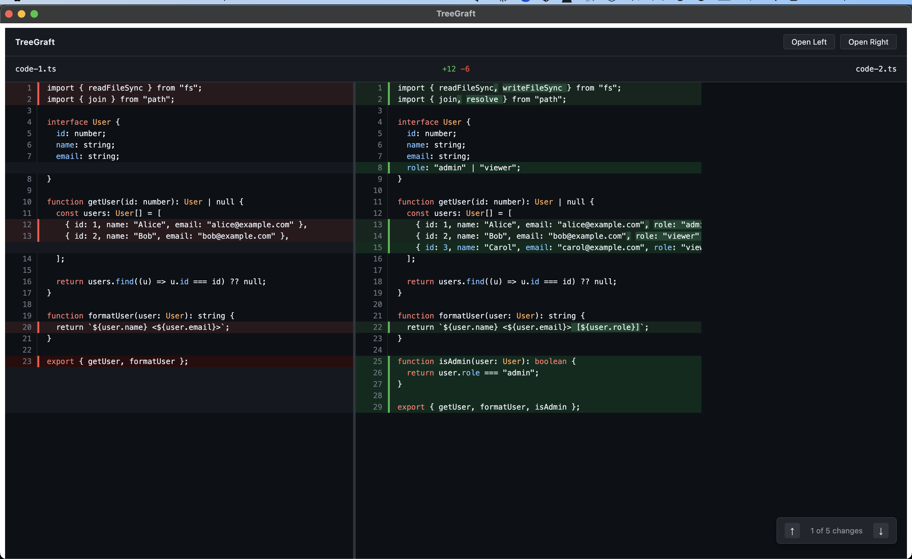

# TreeGraft

A free, local-first Git GUI with structural merge intelligence. TreeGraft
understands code at the level of functions, classes, and entities — not
lines. It automatically resolves independent changes and explains every
merge decision visually, without files ever leaving your machine.

## Current status

Early development. File diff viewer is live — open any two files side by
side with syntax highlighting, intra-line diff, and F7/Shift+F7 hunk
navigation. Full Git GUI and structural merge intelligence coming in v1
and v2.

## Roadmap

See [ROADMAP.md](./ROADMAP.md) for the full feature roadmap and build
order. See [CONTEXT.md](./CONTEXT.md) for architecture decisions and
coding standards.
